# Lab notebook: MATLAB / morphometrics / 3D workstream

This is the running record of the MATLAB side of the ECTE408 study: what was
done, why, how it was checked, what was found, and what went wrong and was
fixed. It is written to serve two readers:

1. **The paper** - every number and figure here can go straight into Methods
   or Supplementary material, with the script that produced it.
2. **You, later** - each step explains the idea in plain words first, then the
   technical detail.

Progress tracker: [`ROADMAP.md`](ROADMAP.md). Each section below matches a
roadmap step.

---

## Contents

- [Status at a glance](#status-at-a-glance)
- [Critical findings for the team](#critical-findings-for-the-team) (read this first)
- [The pipeline in one picture](#the-pipeline-in-one-picture)
- [Step 0 - Environment and parity](#step-0---environment-and-parity)
- [Step 1.1 - Ground-truth volumetrics](#step-11---ground-truth-volumetrics)
- [Step 1.2 - Agreement analysis](#step-12---agreement-analysis-validated-on-damaged-masks)
- [Step 1.3 - 3D renderer](#step-13---3d-renderer)
- [Step 1.4 - Diagnostic report](#step-14---diagnostic-report-panels-1-2-3-5)
- [Step 1.5 - Paper sections](#step-15---paper-sections-that-do-not-need-results)
- [Ready for Stage 3](#ready-for-stage-3-what-to-run-when-predictions-arrive)
- [Corrections log](#corrections-log)
- [File index](#file-index)

---

## Status at a glance

| Step | What | State |
|---|---|---|
| 0 | Environment, parity, data | done |
| 1.1 | Ground-truth volumetrics (74 patients) | done |
| 1.2 | Agreement analysis on damaged masks | done |
| 1.3 | 3D renderer | done |
| 1.4 | Diagnostic report panels 1, 2, 3, 5 | done (panel 4 waits for predictions) |
| 1.5 | Paper sections not needing results | done (draft) |
| 2.x | Teammate: M5-M7, 3D evaluation | waiting on teammate |
| 3-5 | Real predictions, stats, write-up | blocked on 2.x |

---

## Critical findings for the team

These came out of reading the Python code while building the MATLAB side.
They change what the paper can claim, so they should be raised with the
Python-side teammate **before** M5-M7 training and evaluation finish. Each
one has the evidence (file and line) so it can be checked independently.

### C1. Three model pairs are identical in code

The README describes eight different models. In `python/models/factory.py`
only five distinct models exist:

| Described as | Actually built | Identical to |
|---|---|---|
| M2 "NLM denoiser + U-Net" | plain `UNetSingle`, no denoiser anywhere (`factory.py:97`) | **M1** |
| M3 "Low-pass + CLAHE + U-Net" | low band only, no CLAHE (`M3ModelWrapper.forward`, `factory.py:28-31`) | **M5** |
| M7 "Dual-stream with enhanced high band" | same forward pass as M4 (`factory.py:78-81`) | **M4** |

`skimage` CLAHE and top-hat are imported in `factory.py` but never called.
The training logs agree: M1 and M2 have epoch-1 training loss 1.50196 vs
1.50201, i.e. the same run repeated (same seed; tiny CPU non-determinism).

**Why it matters:** comparisons M4 vs M2, M4 vs M3 and M4 vs M7 would be
reported as "vs a denoising baseline", "vs a CLAHE baseline", "vs an enhanced
high band", but they are not. Either implement M2/M3/M7 as described, or
rename and drop them in the paper. M7 has not been trained yet, so this is
cheapest to fix now.

### C2. The degradation barely hurts even the clean-trained baseline

`results/m0_degradation_metrics.csv` (M0, trained on clean data only, 15
validation patients, all 13 conditions):

| Condition | WT Dice | Mean Dice |
|---|---|---|
| clean | 0.8219 | 0.7350 |
| SNR 8, r = 0.5 (worst) | 0.8225 | 0.7292 |
| **drop** | **-0.0006** | **0.0058** |

The baseline loses about half a Dice point at the worst condition. The
final-epoch validation logs show the same for every trained model (WT Dice
clean vs SNR 8 r 0.5: M0 0.847 / 0.846, M1 0.850 / 0.851, M4 0.868 / 0.866).

**Why it matters:**
- **H1** asks M4 to beat M0 by >= 0.05 Dice at SNR = 8. If M0 itself only
  drops 0.006, a 0.05 margin cannot come from robustness at all; it could
  only come from M4 being better on clean data too. H1 is close to
  unreachable as designed.
- **H2** compares clean-to-SNR8 drops. When both drops are ~0.005, the test
  compares two numbers that are both inside run-to-run noise.
- Options to discuss: stronger degradation (lower SNR, e.g. 3-5; through-plane
  resolution loss, since real low-field scans have thick slices), or
  re-framing the study as "under this degradation range, decomposition gives
  no robustness benefit" (a valid negative result).

Visual check of what SNR 8, r = 0.5 looks like: see Step 1.4.

### C3. M4 is trained with degradation augmentation (open question answered)

`python/train.py:159-163`: M0 trains on clean data; **M1-M7 all train with
uniform random sampling over the 13 conditions**. So M4's weak degraded
validation score (CLAUDE.md open issue) is not explained by "M4 never saw
degraded data". The fair robustness comparison for M4 is M1 (same training
data, different architecture), not M0.

### C4. Physics: noise is added at full bandwidth after k-space truncation

`python/physics/degradation.py:91-121`: the image is truncated in k-space
(resolution loss), transformed back, and *then* complex Gaussian noise is
added in image space. That noise is white: it fills every spatial frequency,
including the outer k-space that was just set to zero.

In a real scanner the noise is in the *measured* k-space samples, so a
low-resolution acquisition that is zero-filled has noise **only** in the
acquired central region. The simulation therefore creates a high-frequency
band that is pure noise, which is exactly the regime a model that separates
and down-weights the high band is designed for. This favours M4/M5/M6 in a
way a real low-field scan would not. Worth one sentence in Limitations, or a
one-line change (add noise before truncation) if the team wants to fix it.

Smaller notes on the same file, for the Methods text:
- SNR is a **linear ratio** (sigma = mu_brain / SNR), not decibels.
  `docs/FINDINGS_SPECTRAL.md` says "30 dB"; that label is wrong.
- The k-space is "pseudo" k-space: the FFT of the magnitude image, not raw
  complex scanner data. Standard simplification; should be stated.

### C5. Hyperparameter tuning evidence is very weak

`docs/DECISIONS.md` DEC-004 selects D0 = 0.20 on proxy Dice of 0.0314 vs
0.0264-0.0311 (5 train / 3 val patients, 2 epochs, DEV-001). Dice values of
~0.03 mean the proxy models had not learned to segment, so the ranking is
noise. The NLM "strength" search in `python/tune_cutoff.py:135-173` does not
run NLM at all (its own comment: "without a full NLM implementation").
**Paper:** describe D0 = 0.20 as a prior design choice, not a tuned value.

### C6. Train/test slice mismatch could create false positives

`docs/DEVIATIONS.md` DEV-003: models train only on the 10 largest-tumor axial
slices per patient. Test evaluation runs on all 155 slices, including many
with no tumor (and slices outside the brain). A model that has never seen a
tumor-free slice may predict spurious tumor there. The morphometrics built
here measure exactly this (component count, volume outside the largest
component), so Stage 3 will show whether it happens.

### C7. One seed, 5 epochs, against a config of 3 seeds, 20 epochs

`configs/base.yaml` specifies `epochs: 20` and `seeds: [0, 1, 2]`; every
trained model in `results/M*/` has only `seed_0` with 5 epochs (DEV-003).
With one seed there is no estimate of how much a model's score changes just
from random initialisation. The M1 vs M2 pair (C1) is effectively that
estimate: same code, same seed, and final validation mean Dice still differs
by 0.001 and WT Dice at SNR 8 by 0.009. Model differences of a similar size
cannot be attributed to architecture. At least 3 seeds for M0, M1 and M4
would make H2 testable.

### C8. Spectral "findings" are hard-coded text; one claim does not hold

`matlab/spectral_analysis.m` writes `docs/FINDINGS_SPECTRAL.md` with fixed
`fprintf` sentences ("over 92%", "drops below 0 dB"): they are not computed
from the data, and the script uses unseeded noise. Measured independently
(`matlab/spectral_check.m`, Step 1.5):

| Claim | Measured | Verdict |
|---|---|---|
| > 92 % of clean power in D < 0.20 | FLAIR 95.1 % (min 92.5 %); T1ce 91.9 % (min 88.4 %), excl. DC | roughly; not "over 92 %" for every T1ce slice |
| high band < 0 dB SNR at SNR 8-12, r <= 0.75 | +1.0 to +5.6 dB; never below 0 in any condition | **not supported** |

So `FINDINGS_SPECTRAL.md` should not be cited; `docs/PAPER_DRAFT.md`
Section 2.6 uses the measured values.

### C9. HD95 penalises a correct "no tumor" prediction

`python/metrics/evaluation.py:38`: `if np.sum(pred_b) == 0 or
np.sum(target_b) == 0: return 373.13`. When **both** masks are empty (a
patient with no ET, and a model that correctly predicts none), the function
returns the maximum penalty instead of 0. The BraTS convention scores this
case as a perfect match. Five test patients have no ET, so every model's mean
ET HD95 is inflated by roughly 5/74 x 373 = ~25 mm even if it is perfect on
them. One-line fix: return 0.0 when both are empty. (Dice handles this case
correctly: 1.0 when both empty.) Until fixed, report median HD95, not mean.

### Checked and fine

- **Crop:** the Python 192 x 192 in-plane crop loses 18 tumor voxels in total
  across all 369 patients (one patient, 344; 0.00005 % of tumor). Negligible.
  `matlab/check_crop_retention.m`, `results/crop_tumor_retention.csv`.
- **Parity:** MATLAB reproduces the reference outputs exactly (Step 0).

---

## The pipeline in one picture

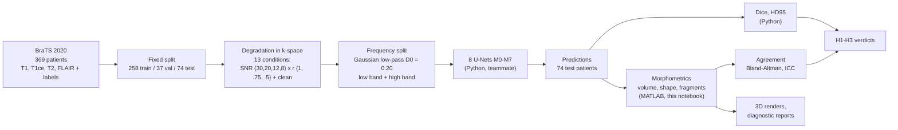

**In plain words:** we take real brain scans, make them look like they came
from a cheap low-field scanner, split each image into a "smooth" part and a
"detail" part, and train networks to outline the tumor. Python measures how
well the outline overlaps the truth (Dice). The MATLAB side measures whether
the *tumor measurements a doctor would use* (volume, shape) stay correct.

The three tumor regions everything refers to:

| Region | Labels (raw BraTS) | What it is |
|---|---|---|
| WT, whole tumor | 1 + 2 + 4 | everything abnormal, including swelling (edema) |
| TC, tumor core | 1 + 4 | the solid tumor without the swelling |
| ET, enhancing tumor | 4 | the actively growing part that lights up with contrast |

Python predictions store ET as label **3** instead of 4. All MATLAB code
accepts both.

---

## Step 0 - Environment and parity

**Idea:** before measuring anything, prove that (a) the tools exist, (b) the
MATLAB versions of the physics give the same numbers as the Python versions
the networks were trained with, and (c) the data is complete.

**Script:** `matlab/env_check.m` (rerunnable, ~30 s).

| Check | Result |
|---|---|
| MATLAB | R2026b (26.2) - project spec says R2025a; parity below shows no difference |
| Image Processing Toolbox | licensed |
| Statistics and Machine Learning Toolbox | **not installed** - ICC etc. are implemented by hand and tested |
| Parity, `degrade_slice` (4 SNR x 3 r, 5 slices) | max abs diff **0** |
| Parity, `decompose_slice` low / high (4 D0, 5 slices) | max abs diff **0** |
| low + high = original | max error 5.1e-7 (float32 rounding) |
| Test data | 74 / 74 patients, 5 files each, all 240 x 240 x 155 at 1 x 1 x 1 mm, labels {0,1,2,4} |

**What parity does and does not prove.** The reference file
`parity_matlab_results.mat` was itself produced by MATLAB (on the teammate's
R2025a). So this run proves MATLAB reproduces MATLAB across machines and
versions, bit for bit. The MATLAB-vs-Python comparison is
`tests/test_degradation.py::test_matlab_python_parity` (tolerance 1e-4); it
needs the teammate's environment to rerun. For the paper, quote both.

**Why low + high = original matters.** The low-pass filter is
`H_lp = exp(-D^2 / (2 D0^2))` and the high-pass is `1 - H_lp`. They add to
exactly 1 at every frequency, so splitting loses nothing: the network gets
all the information in the original image, just rearranged.

**Data quirk:** patient 355's segmentation is named
`W39_1998.09.19_Segm.nii` in the Kaggle copy (it is in the training split, so
it does not affect test-set work). Scripts that loop over all patients find
the seg file by pattern.

---

## Step 1.1 - Ground-truth volumetrics

**Idea:** turn each tumor outline into the numbers a clinician or a paper
would quote: how big, how much surface, how round, how stretched, how many
separate pieces. Do it on the expert outlines now so that, when predictions
arrive, the identical code measures them and the two can be compared.

**Scripts:**
- `matlab/tumor_biomarkers.m` - the measuring function. Ground truth,
  synthetic damage (Step 1.2) and predictions (Stage 3) all go through it, so
  the method cannot differ between them.
- `matlab/test_tumor_biomarkers.m` - known-answer tests (all pass).
- `matlab/volumetrics.m` - loops over the 74 test patients (`SOURCE = 'gt'`
  now, `'pred'` in Stage 3; refuses to run on a partially filled predictions
  folder).
- `matlab/figures_volumetrics.m` - the two figures below.

**Output:** `results/volumetrics_gt.csv`, 222 rows (74 patients x 3 regions).

### What is measured, in plain words

| Column | Plain meaning | How |
|---|---|---|
| `volume_cm3` | size | voxel count x voxel volume from the NIfTI header (1 mm^3 here) / 1000 |
| `surface_area_mm2` | area of the tumor's skin | `regionprops3` SurfaceArea, **summed over pieces** (see bug below) |
| `surface_area_mesh_mm2` | same, second method | marching-cubes mesh (`isosurface`) after Gaussian smoothing sigma = 0.5 voxel |
| `sphericity` | 1 = perfect ball, lower = irregular | pi^(1/3) (6V)^(2/3) / A |
| `elongation` | 1 = round, near 0 = cigar | 2nd / 1st principal axis length |
| `n_components` | number of separate pieces | 26-connected components |
| `frac_outside_largest` | how much volume sits in the small pieces | 1 - largest piece / total |

Empty regions (no ET in some LGG patients) give volume 0, 0 pieces, and NaN
for every shape measure, never an error.

### Choosing the surface-area method

A voxelised tumor is made of little cubes, so its surface is a staircase. If
you count the cube faces you overestimate the true smooth surface, and the
overestimate does not shrink with size: it stays near +50 %. That would push
every sphericity value down by about a third.

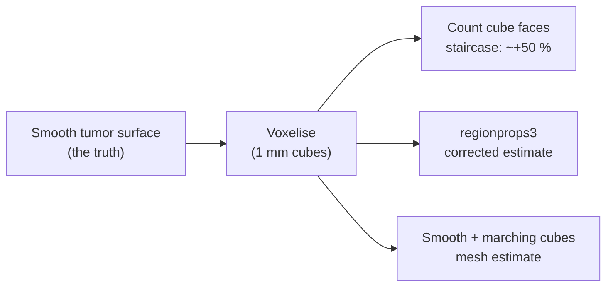

To pick a method, all three were run on digital spheres, where the true area
4 pi R^2 is known:

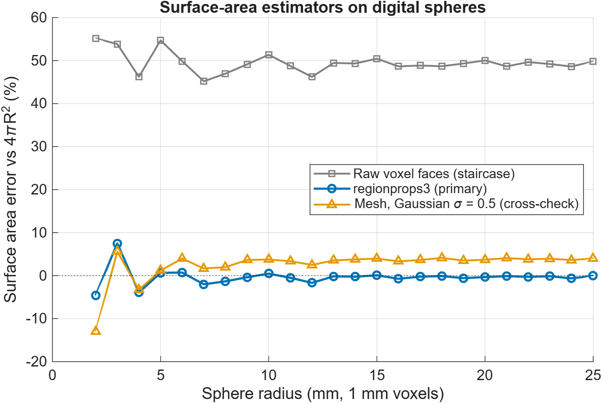

| Method | Error for radius >= 8 mm | Verdict |
|---|---|---|
| Raw voxel faces | +45 % to +55 % | unusable |
| `regionprops3` | within 1.7 % | **primary** |
| Mesh, sigma = 0.5 | +2 % to +4 % (slight constant overestimate) | cross-check |
| Mesh, sigma = 1.0 (tested, rejected) | -0.5 % at R = 20, **-19 %** at R = 3 | erases small ET blobs |

So in R2026b `regionprops3` already corrects for staircasing (a 10^3 cube
gives 524.6, not 600 faces). Below about 5 mm radius every method is
unreliable, which matters for very small ET regions.

### Bug found and fixed: `regionprops3` surface of a multi-piece region

The two methods were plotted against each other on the real tumors and
disagreed badly for some patients (Spearman correlation only 0.57-0.78).
Tracking it down:

| Test | `regionprops3` SurfaceArea (one label) | Correct |
|---|---|---|
| one sphere, R = 10 | 1263 | 1263 |
| two identical separate spheres | **1263** | 2525 |
| sphere + one stray voxel far away | **3** | ~1266 |

**When a single label covers several disconnected pieces, `regionprops3`
returns the surface of only one of them** (apparently the first in memory
order). Real tumors have a median of 2-3 pieces, and model predictions with
stray false-positive blobs would have more, so this would have silently
corrupted every surface and sphericity value, worst for exactly the
predictions we most need to measure. The old `volumetrics.m` had the same
problem (it took the max over pieces).

**Fix:** measure surface per connected piece and sum. Principal axes are not
affected (verified: they use all voxels). Regression test 6b in
`test_tumor_biomarkers.m` (two spheres must give exactly 2x one sphere, by
both methods). After the fix the methods agree: Spearman 0.996 (WT), 0.994
(TC), 0.992 (ET); median mesh / primary sphericity ratio 0.99.

**Lesson worth keeping:** the cross-check was not decoration. It is the only
reason this was caught.

### Results: the 74 test patients (59 HGG, 15 LGG)

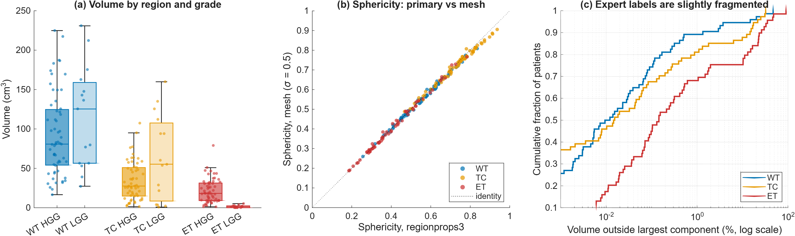

*(a) volume per region, split by grade (darker = HGG). (b) sphericity by the
two methods, one dot per patient-region; the identity line is dotted.
(c) cumulative distribution of the share of volume outside the largest piece;
patients whose region is a single piece (fraction exactly 0) cannot appear on
a log axis, which is why the curves start above 0.*

| Region | Median volume (cm^3) | Range | Empty | Median sphericity | Median pieces (max) |
|---|---|---|---|---|---|
| WT | 81.3 | 16.6 - 230.9 | 0 | 0.554 | 3 (49) |
| TC | 28.6 | 0.8 - 159.9 | 0 | 0.744 | 2 (44) |
| ET | 13.2 | 0 - 79.0 | 5 | 0.377 | 3 (50) |

Observations:
- **No ET in 5 patients, all LGG** (266, 279, 281, 310, 335). Expected
  biology: low-grade tumors often do not enhance. These are the candidates
  for the "no ET" diagnostic example (Step 1.4).
- **LGG whole tumors are not smaller than HGG** here (median ~125 vs ~81
  cm^3) but their ET is tiny or absent.
- **ET is the least round** (median sphericity 0.38): enhancing tumor is
  typically a rim around a necrotic core, a shell rather than a ball.
- **The expert labels themselves are fragmented**, but the fragments are
  tiny: median share outside the largest piece is 0.01 % (WT), and 90 % of
  patients are below 1.3 % (WT). In Stage 3, prediction fragmentation must
  therefore be compared against each patient's own truth, not against zero.

---

## Step 1.2 - Agreement analysis, validated on damaged masks

**Idea:** in Stage 3 we will ask "does the predicted tumor volume agree with
the true volume?". Before trusting the code that answers that, feed it
outlines where **we already know the answer**: take the true outline, damage
it in a controlled way, and check the code reports exactly that damage. A
scale is checked with known weights before weighing anything unknown; this
is the same idea.

**Scripts:**
- `matlab/damage_mask.m` - applies one controlled damage to a label volume
  and returns the exact expected change where one exists.
- `matlab/agreement_stats.m` - Bland-Altman bias and limits, ICC(A,1),
  ICC(C,1), % volume error, bootstrap 95 % CIs (fixed seed 42).
  Hand-written (no Statistics Toolbox).
- `matlab/test_agreement_stats.m` - reproduces the published Shrout &
  Fleiss (1979) worked example: ICC(2,1) = 0.290 (published 0.29),
  ICC(3,1) = 0.715 (published 0.71); plus perfect-agreement, constant-offset,
  proportional and NaN cases. All pass.
- `matlab/agreement_validation.m` - runs 7 damage types on all 74 patients
  (~9 min), writes the CSVs and the three figures below.

**Outputs:** `results/agreement_damaged_biomarkers.csv` (1554 rows,
patient x damage x region, full biomarkers + Dice),
`results/agreement_validation.csv` (summary with CIs).

### The three agreement tools in plain words

| Tool | Question it answers | Reading it |
|---|---|---|
| **% volume error** | "by how much is this patient's volume off?" | 100 (pred - true) / true |
| **Bland-Altman plot** | "is there a systematic over/under-estimate, and how big is the spread?" | x = average of the two, y = difference. Solid line = **bias** (average error). Dashed lines = **limits of agreement**: 95 % of patients' errors fall between them |
| **ICC** (intraclass correlation) | "can the two measurements be swapped for one another?" | 1 = perfect. **ICC(A,1)** (absolute) is lowered by a constant offset; **ICC(C,1)** (consistency) only asks whether the ranking is right. A big gap between them = "right ordering, wrong level" |

### The damage menu

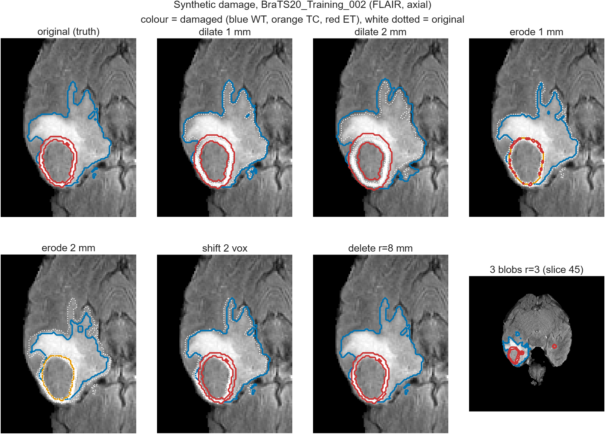

*One test patient, axial FLAIR, zoomed on the tumor. Coloured lines are the
damaged outlines, white dotted lines the original. In this patient the tumor
core's outer edge coincides with the enhancing ring (the core is the ring
plus the dead tissue inside it), so the orange TC line sits under the red ET
line except where erosion has destroyed the thin ring (erode 1-2 mm). The
blobs panel shows the full slice through one of the three added blobs.*

| Damage | What it imitates in a real model | Known answer |
|---|---|---|
| dilate 1 / 2 mm | over-segmentation, outline drawn too wide | volume added ~ surface area x offset |
| erode 1 / 2 mm | under-segmentation, too tight | volume removed ~ surface area x offset |
| shift 2 voxels | registration / position error | volume unchanged |
| delete r = 8 mm ball | a missed part of the tumor | removed voxels counted exactly |
| 3 blobs r = 3 | scattered false-positive spots elsewhere in the brain | +3 x 123 voxels = +0.369 cm^3, +3 pieces |

### Did the code report the known answers?

| Check | Expected | Measured | Pass |
|---|---|---|---|
| delete: volume removed | exact voxel count | deviation **0 voxels**, every patient, every region | yes |
| blobs: volume added | +0.369 cm^3 | bias **+0.369**, SD 0 | yes |
| blobs: extra pieces | +3 | median **+3** | yes |
| shift: volume | unchanged | bias **0.000**, ICC 1.000 | yes |
| dilate 1 mm: volume added vs Steiner prediction | ratio 1 | median ratio **1.014** (WT), 1.032 (TC), 1.006 (ET) | yes |
| dilate 2 mm | ratio ~1 | 0.98 / 1.02 / 0.96 | yes |
| erode 2 mm | ratio ~1, falling where thin parts vanish | 0.94 / 0.92 / **0.87** | as expected |

**The Steiner prediction, explained.** Growing any smooth shape outward by a
thin layer d adds roughly (surface area) x d of volume, like painting a
coat onto it. On a voxel grid the effective layer thickness is not exactly
d, so it was calibrated once on a digital sphere (R = 30): growing by 1 mm
adds 0.851 mm^3 per mm^2 of surface; 2 mm adds 1.83; eroding removes 0.814
and 1.65. That single sphere-derived factor then predicts each real tumor's
change from its own surface area:

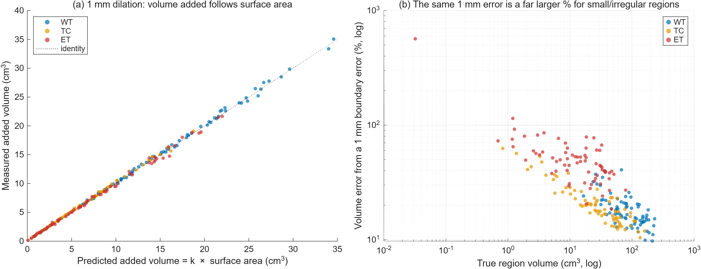

*(a) Every dot is one patient-region after 1 mm dilation. They lie on the
identity line: the code's volumes behave exactly as the geometry says they
must. (b) The same 1 mm boundary error expressed as a percentage of each
region's volume.*

### Bland-Altman results (whole tumor)

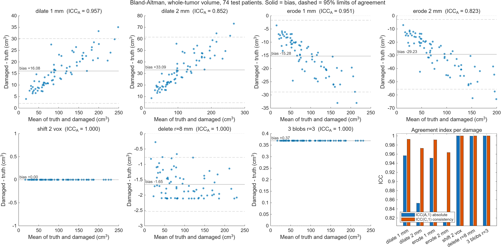

Full table: `results/agreement_validation.csv`. Key rows (bias with 95 %
bootstrap CI, n = 74; ET n = 74 including the 5 empty, whose damaged volume
also stays 0):

| Damage | Region | Bias (cm^3) | Median abs % error | ICC(A,1) [95 % CI] | ICC(C,1) | Mean Dice |
|---|---|---|---|---|---|---|
| dilate 1 mm | WT | +16.1 [14.5, 17.7] | 16.8 | 0.957 [0.944, 0.965] | 0.993 | 0.915 |
| dilate 1 mm | ET | +7.3 [6.0, 8.7] | **48.2** | 0.883 [0.839, 0.913] | 0.950 | 0.796 |
| erode 2 mm | ET | -12.4 [-14.8, -10.1] | **79.7** | 0.430 [0.287, 0.543] | 0.648 | 0.340 |
| shift 2 vox | ET | 0.00 | 0.0 | 1.000 | 1.000 | **0.707** |
| 3 blobs | WT | +0.37 | 0.5 | **1.000** | 1.000 | **0.997** |

### What this teaches (for the Discussion section)

1. **A 1 mm outline error is clinically small for WT and large for ET.** The
   same one-voxel error changes whole-tumor volume by ~17 % but enhancing
   tumor by ~48 % (and up to >100 % for ET regions under ~2 cm^3, panel b).
   ET is thin (a shell) and small, so it has a lot of surface per unit of
   volume. Expect ET volume to be the first biomarker to break under
   degradation, and expect ET Dice to be lowest for the same reason.
2. **ICC alone is a weak verdict.** A systematic 17 % over-estimate of every
   tumor still scores ICC(A,1) = 0.957, "excellent" by the usual > 0.9 rule.
   Always report the Bland-Altman bias next to ICC. The gap ICC(C,1) 0.993
   vs ICC(A,1) 0.957 is the signature of a systematic offset.
3. **Volume agreement does not mean location agreement.** Shifting the
   tumor 2 mm leaves every volume perfect (ICC 1.000) while ET Dice falls to
   0.71. Volume and overlap are different questions; the paper needs both.
4. **Neither Dice nor volume notices scattered false positives.** Three
   spurious 0.12 cm^3 blobs elsewhere in the brain leave Dice at 0.997 and
   ICC at 1.000. Only the component count (+3) flags them, and HD95 (Python)
   would too. Clinically such a blob could be read as a second lesion.
   This is why `n_components` and `frac_outside_largest` are in the table,
   and why Stage 3 should report them (see also C6: models trained only on
   tumor slices may create exactly this).
5. **Fragment count moves in both directions.** Dilation merges nearby
   fragments (median -1 to -2 pieces); 2 mm erosion splits thin ET rims
   (median +2 pieces). A change in piece count is a boundary-quality signal,
   not only a false-positive signal.

---

## Step 1.3 - 3D renderer

**Idea:** numbers say *how much* a prediction is wrong; a 3D picture shows
*where*. The renderer draws the brain as a ghost, the tumor regions inside it
in colour, truth and prediction side by side, and a third panel where the
predicted tumor's skin is painted by how far each point is from the true
boundary.

**Scripts:**
- `matlab/render_tumor_3d.m` - the renderer (function; reusable in Stage 3
  with real predictions). Optional STL export of every surface (for 3D
  printing or viewing in any mesh viewer).
- `matlab/render3d_demo.m` - runs it on damaged masks with known answers and
  asserts the error map reports them.

**How it works, step by step:**

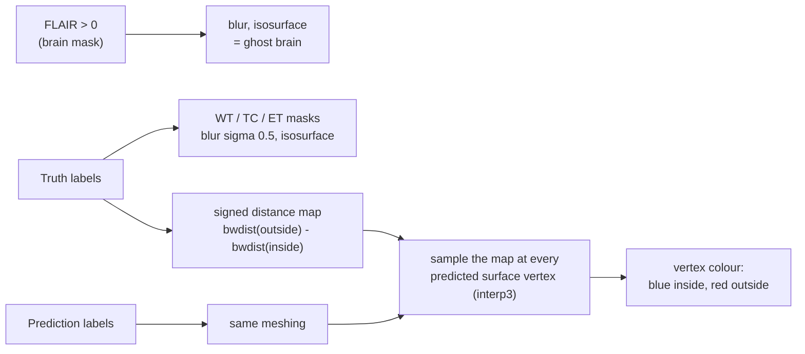

- **Meshes:** each mask is lightly blurred (sigma 0.5 voxel, the same as the
  surface cross-check in Step 1.1) and turned into a triangle surface by
  marching cubes (`isosurface`), then drawn with `patch`. WT and TC are
  see-through so the inner regions stay visible.
- **Error colour:** `bwdist` gives every voxel its distance to the nearest
  truth voxel (positive outside) and to the nearest non-truth voxel
  (negative inside). Their difference is a *signed distance map*: 0 on the
  true boundary, +3 means 3 mm outside it, -3 means 3 mm inside it. Every
  vertex of the predicted surface reads this map, so its colour says how far
  and in which direction that bit of the prediction is off.

**Validation (known answers):** `results/render3d_surface_error.csv`

| Case | Mean signed error | Mean abs error | Expected | Pass |
|---|---|---|---|---|
| truth vs itself | -0.03 mm | 0.20 mm | ~0 (mesh smoothing only) | yes |
| dilated 2 mm | **+2.04 mm** | 2.04 mm | +2 | yes |
| eroded 2 mm | **-2.05 mm** | 2.05 mm | -2 | yes |
| shifted 2 voxels | +0.13 mm | 1.32 mm | ~0 signed (one side +, other side -) | yes |
| 3 blobs | +0.99 mm | 1.21 mm | blobs' vertices are far outside | as expected |

The 0.2 mm "floor" when comparing truth with itself is the smoothing of the
mesh; any real prediction error below ~0.5 mm is not resolvable with 1 mm
voxels anyway.

**Truth vs 2 mm dilation** - every point of the prediction is ~2 mm outside
the truth, so the whole surface is uniformly light red:

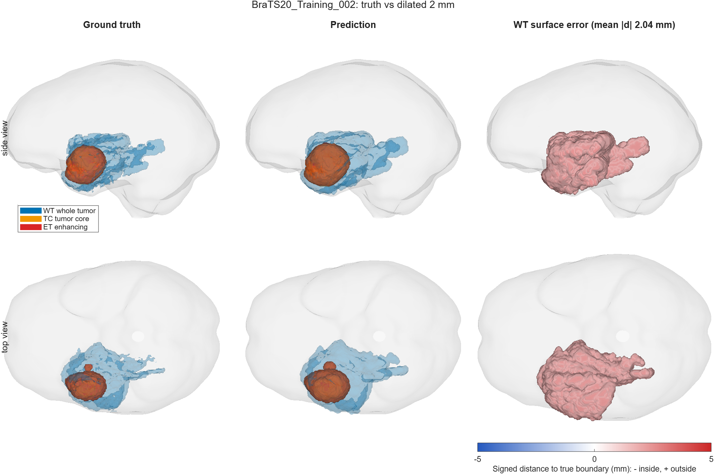

**Truth vs 2-voxel shift** - same volume, but the leading edge is red
(outside the truth) and the trailing edge blue (inside). This is the
picture of "volume right, location wrong" from Step 1.2:

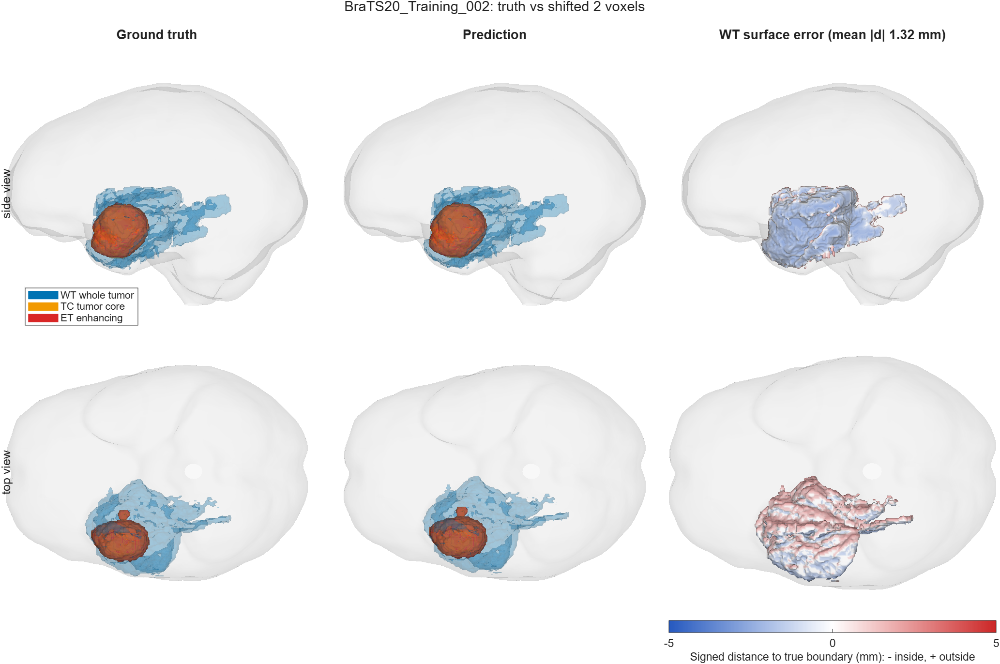

Also produced: `figures/render3d_self.png`, `render3d_erode2.png`,
`render3d_blobs.png`.

**Orientation note (for figure captions):** BraTS arrays are stored with
dimension 1 = left-right and dimension 2 = front-back. The "side view" looks
along the left-right axis; the "top view" looks down the head-foot axis.

**Stage 3 use:** `render_tumor_3d(flair, truth, pred, spacing, png, title)`
with `pred` from `results/predictions/M0_<id>_snr8_r0.5.nii.gz` and the M4
equivalent gives the baseline-vs-proposed 3D comparison.

---

## Step 1.4 - Diagnostic report (panels 1, 2, 3, 5)

**Idea:** one page per patient that a reader can take in at a glance: the
scan, what the degraded scan looks like, where the tumor really is, what the
model said (Stage 3), and what the model actually receives after the
frequency split. Five patients, chosen by a rule fixed in advance so no one
can say the examples were cherry-picked.

**Script:** `matlab/diagnostic_report.m` (rewritten; the old version had
the teammate's absolute path, picked the first 5 test IDs, and needed
predictions). Outputs `figures/diagnostic_<case>_<id>.png` and
`results/diagnostic_selection.csv`.

### Selection rule (for the paper's Methods)

> Five test patients were selected for qualitative display before any model
> predictions were inspected, using only ground-truth whole-tumor (WT)
> volume, enhancing-tumor (ET) presence and grade: the HGG patients (with ET)
> closest to the 10th, 50th and 90th percentile of HGG WT volume; the LGG
> patient with ET closest to that subgroup's median WT volume; and the LGG
> patient without ET closest to that subgroup's median WT volume. Ties were
> broken by lowest patient ID.

| Case | Role | Patient | Grade | WT (cm^3) | Group target | Group size |
|---|---|---|---|---|---|---|
| 1 | HGG small (10th pct) | BraTS20_Training_008 | HGG | 33.4 | 33.2 | 59 |
| 2 | HGG typical (median) | BraTS20_Training_167 | HGG | 80.8 | 80.8 | 59 |
| 3 | HGG large (90th pct) | BraTS20_Training_236 | HGG | 169.9 | 170.7 | 59 |
| 4 | LGG with ET (median) | BraTS20_Training_292 | LGG | 77.0 | 78.3 | 10 |
| 5 | LGG no ET (median) | BraTS20_Training_281 | LGG | 143.1 | 143.1 | 5 |

### The panels, and what each one is for

- **1 Clean FLAIR** - the reference.
- **2 Degraded FLAIR, SNR 8, r 0.5** - the worst of the 13 conditions,
  generated with the parity-verified `degrade_slice.m`, on the same 192 x 192
  crop and with the same noise calibration (sigma = mean brain intensity / 8)
  as the Python pipeline. The noise realisation is MATLAB's (seed 42): the
  Python test noise comes from a SHA256-seeded PyTorch generator that MATLAB
  cannot replay, so the pattern differs while the statistics are identical.
- **3 Ground truth** outlines on the clean image.
- **4 Prediction** - placeholder until Stage 3; flip `USE_PREDICTIONS` to
  true once all predictions exist.
- **5a/b Low and high band of the degraded input** at D0 = 0.20, computed the
  way the network sees it: degrade raw intensities, z-score inside the
  brain, then split (`python/data/dataset.py:181-192`, then the model's
  `FrequencyBandDecomposition`).
- **5c High band of the clean input** - added for comparison; it makes the
  whole rationale of the study visible (below).

**Case 2, typical HGG:**

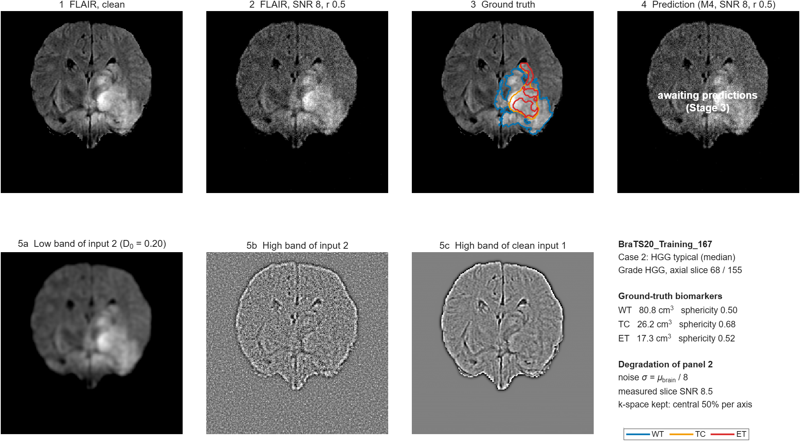

**Case 5, LGG without enhancing tumor:**

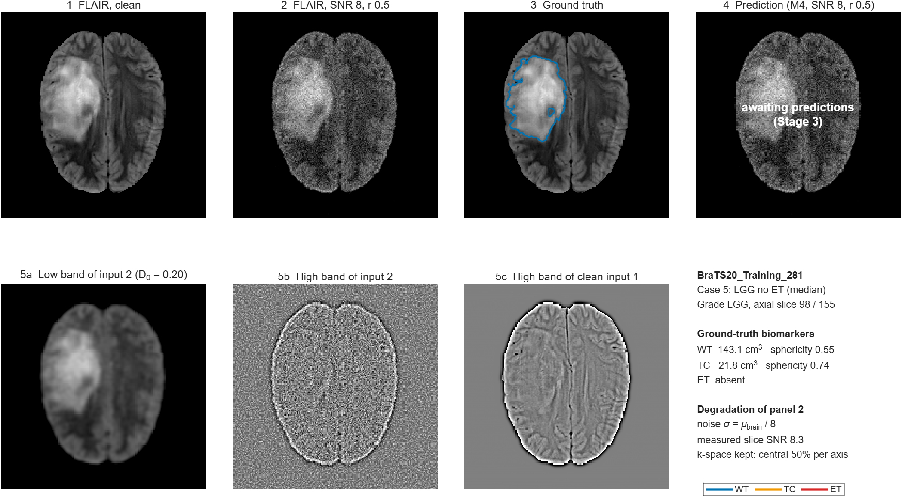

### What the panels show

1. **The study's premise, in one picture (5b vs 5c).** In the clean image
   the high band holds real anatomy: tissue edges, ventricles, sulci. At
   SNR 8 the high band is almost pure noise, while the low band (5a) still
   carries the tumor clearly. That is why a model that treats the two bands
   separately *could* help.
2. **...and the reason it may not matter here (panel 2).** Even at the worst
   condition the tumor is obvious to the eye. This is the visual side of
   critical finding C2: the degradation is mild enough that a normal U-Net
   barely loses accuracy, which leaves little room for a robustness gain.
3. **The noise level is what the paper says it is.** Measuring SNR directly
   in each degraded slice (brain mean / noise sigma estimated from the
   background, which follows a Rayleigh distribution:
   sigma = mean(background) / sqrt(pi/2)) gives 8.1-8.5 for four cases and
   9.8 for case 1. The nominal value is 8; case 1 is higher because its
   slice is brighter than the whole-volume brain mean that sets the noise.
   This is an independent end-to-end check of the degradation physics.
4. **Case 5 shows why "no ET" matters for metrics.** There is no enhancing
   tumor to find, so any ET a model predicts is a pure false positive and ET
   Dice is 0 or undefined. The Python metrics need an explicit convention for
   this (see the Stage 3 checklist).

Other cases: `figures/diagnostic_1_BraTS20_Training_008.png`,
`_3_..._236.png`, `_4_..._292.png`.

---

## Step 1.5 - Paper sections that do not need results

**Output:** [`PAPER_DRAFT.md`](PAPER_DRAFT.md) - Introduction, Methods
2.1-2.10, the Discussion points and Limitations already established, and a
reference list. Every number is traceable to a script in this repo; every
open team decision is marked `[TEAM: ...]`; every citation is marked
"verify" (written from memory, must be checked against the source).

**While writing it, one more thing was measured rather than copied:** the
spectral analysis (C8).

**Script:** `matlab/spectral_check.m` - first 12 test patients (same sample
as the teammate's export), largest-tumor slice, 192 x 192 crop, raw
intensities, seed 42.

**Idea in plain words.** Picture the image as a sum of waves: slow waves
make the smooth shading, fast waves make edges and texture. "Power at low
frequency" = how much of the picture is smooth shading. "Band SNR" = in a
given range of wave speeds, how strong is the real anatomy compared with
what the degradation changed (noise plus lost sharpness).

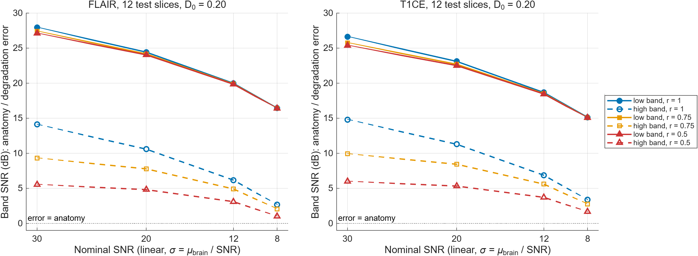

*Solid = low band (D < 0.20), dashed = high band. Colours = resolution
level. Right is worse.*

| Nominal SNR | r | FLAIR low / high (dB) | T1ce low / high (dB) |
|---|---|---|---|
| 30 | 1.0 | 28.0 / 14.1 | 26.6 / 14.8 |
| 12 | 0.75 | 19.9 / 4.9 | 18.5 / 5.6 |
| 8 | 1.0 | 16.5 / 2.7 | 15.1 / 3.4 |
| 8 | 0.5 | 16.4 / 1.0 | 15.1 / 1.7 |

What it shows:
1. **The premise holds:** degradation lands mostly in the high band. The
   low band stays above 15 dB (error < 3 % of anatomy) even at the worst
   condition; the high band loses 12-13 dB.
2. **Resolution loss is a high-band phenomenon:** at SNR 30 the high band
   drops 14.1 -> 9.3 -> 5.5 dB as r goes 1 -> 0.75 -> 0.5; the low band
   barely moves.
3. **But nothing ever becomes noise-dominated** (no band below 0 dB), and
   the low band, which carries 92-97 % of the image, is nearly untouched.
   That is the spectral explanation of C2: there is not much damage for a
   robustness method to undo.

---

## Ready for Stage 3: what to run when predictions arrive

Only when the teammate confirms **all** of `results/predictions/` is written
(8 models x 74 patients x 3 conditions + `ground_truth/`):

1. `matlab/check_crop_retention.m` already done; additionally compare
   `results/predictions/ground_truth/GT_*.nii.gz` volumes with
   `results/volumetrics_gt.csv` (should match to the 18-voxel crop loss).
2. `matlab/volumetrics.m` with `SOURCE = 'pred'` ->
   `results/volumetrics_pred.csv` (refuses to run on a partial folder).
3. Agreement per model x condition: `agreement_stats(gt.volume_cm3,
   pred.volume_cm3)` for each region - same function validated in Step 1.2.
   Also report sphericity agreement and extra components vs truth.
4. `matlab/diagnostic_report.m` with `USE_PREDICTIONS = true` (panel 4).
5. `render_tumor_3d` for M0 vs M4 at `snr8_r0.5` on the 5 selected patients.
6. Empty-ET conventions: Python Dice already follows BraTS (1 if both
   empty, 0 if one is). Python HD95 does not (C9): fix before final
   evaluation, or report median HD95.
7. The other 10 conditions have no NIfTI predictions; their volumes are in
   `results/raw_metrics.csv` (`vol_pred_*_cm3`), enough for volume agreement
   but not for shape or fragmentation.

---

## Corrections log

Anything reported earlier that turned out wrong, so nothing silently changes.

| When | What was said | Correction | Why |
|---|---|---|---|
| Step 1.1, first run | Median sphericity WT 0.591, TC 0.781, ET 0.430 | WT 0.554, TC 0.744, ET 0.377 | `regionprops3` multi-piece bug (above); first run under-counted surface area |
| Step 0 / 1.1 | "Image Processing Toolbox is all we need" | Statistics Toolbox is also absent | found when `corr` failed; stats are hand-implemented and tested |

---

## File index

| File | Purpose |
|---|---|
| `matlab/env_check.m` | Step 0 environment, parity, data check |
| `matlab/tumor_biomarkers.m` | shared biomarker function |
| `matlab/test_tumor_biomarkers.m` | its tests |
| `matlab/volumetrics.m` | 74-patient driver, gt / pred modes |
| `matlab/figures_volumetrics.m` | Step 1.1 figures |
| `matlab/check_crop_retention.m` | crop check (C-section, "checked and fine") |
| `results/volumetrics_gt.csv` | ground-truth biomarkers |
| `results/crop_tumor_retention.csv` | tumor voxels lost to crop, per patient |
| `figures/surface_area_validation.png` | surface method validation |
| `figures/volumetrics_gt_cohort.png` | cohort distributions |
| `matlab/damage_mask.m` | controlled synthetic damage |
| `matlab/agreement_stats.m` | Bland-Altman, ICC, % error, bootstrap CIs |
| `matlab/test_agreement_stats.m` | its tests (Shrout & Fleiss reference) |
| `matlab/agreement_validation.m` | Step 1.2 driver + figures |
| `results/agreement_damaged_biomarkers.csv` | biomarkers of every damaged mask |
| `results/agreement_validation.csv` | agreement summary per damage x region |
| `figures/agreement_damage_examples.png` | what each damage looks like |
| `figures/agreement_bland_altman_wt.png` | Bland-Altman per damage |
| `figures/agreement_boundary_error.png` | Steiner check + size effect |
| `matlab/render_tumor_3d.m` | 3D renderer + error heatmap + STL export |
| `matlab/render3d_demo.m` | Step 1.3 demo with known-answer checks |
| `results/render3d_surface_error.csv` | surface error per demo case |
| `figures/render3d_*.png` | 3D renders (self, dilate2, erode2, shift2, blobs) |
| `matlab/diagnostic_report.m` | Step 1.4 selection rule + per-patient report |
| `results/diagnostic_selection.csv` | the 5 selected patients and why |
| `figures/diagnostic_<n>_<id>.png` | the 5 reports |
| `matlab/spectral_check.m` | measured spectral claims (C8, Section 2.6) |
| `results/spectral_check.csv` | per patient x modality x condition band SNR |
| `figures/spectral_band_snr.png` | band SNR figure |
| `docs/PAPER_DRAFT.md` | Introduction + Methods draft |
