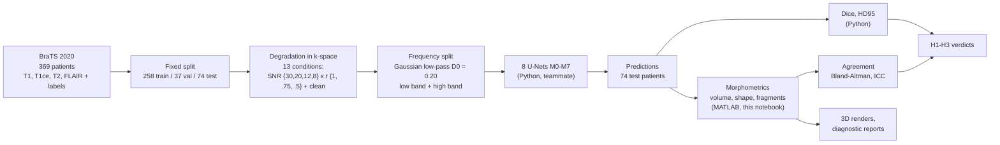
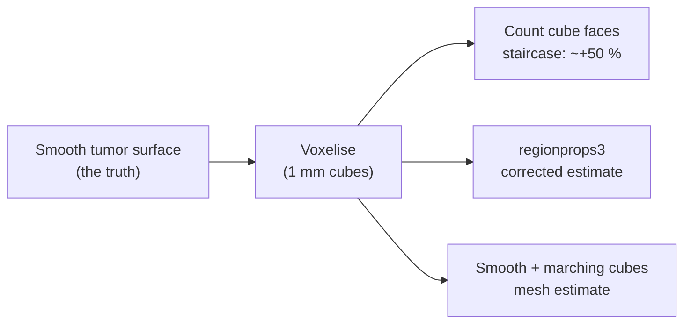

# Lab notebook: MATLAB / morphometrics / 3D workstream

This is the running record of the MATLAB side of the ECTE408 study: what was
done, why, how it was checked, what was found, and what went wrong and was
fixed. It is written to serve two readers:

1. **The paper** - every number and figure here can go straight into Methods
   or Supplementary material, with the script that produced it.
2. **You, later** - each step explains the idea in plain words first, then the
   technical detail.

Progress tracker: [`ROADMAP.md`](ROADMAP.md). Each section below matches a
roadmap step.

---

## Contents

- [Status at a glance](#status-at-a-glance)
- [Critical findings for the team](#critical-findings-for-the-team) (read this first)
- [The pipeline in one picture](#the-pipeline-in-one-picture)
- [Step 0 - Environment and parity](#step-0---environment-and-parity)
- [Step 1.1 - Ground-truth volumetrics](#step-11---ground-truth-volumetrics)
- [Corrections log](#corrections-log)
- [File index](#file-index)

---

## Status at a glance

| Step | What | State |
|---|---|---|
| 0 | Environment, parity, data | done |
| 1.1 | Ground-truth volumetrics (74 patients) | done |
| 1.2 | Agreement analysis on damaged masks | in progress |
| 1.3 | 3D renderer | to do |
| 1.4 | Diagnostic report panels 1, 2, 3, 5 | to do |
| 1.5 | Paper sections not needing results | to do |
| 2.x | Teammate: M5-M7, 3D evaluation | waiting on teammate |
| 3-5 | Real predictions, stats, write-up | blocked on 2.x |

---

## Critical findings for the team

These came out of reading the Python code while building the MATLAB side.
They change what the paper can claim, so they should be raised with the
Python-side teammate **before** M5-M7 training and evaluation finish. Each
one has the evidence (file and line) so it can be checked independently.

### C1. Three model pairs are identical in code

The README describes eight different models. In `python/models/factory.py`
only five distinct models exist:

| Described as | Actually built | Identical to |
|---|---|---|
| M2 "NLM denoiser + U-Net" | plain `UNetSingle`, no denoiser anywhere (`factory.py:97`) | **M1** |
| M3 "Low-pass + CLAHE + U-Net" | low band only, no CLAHE (`M3ModelWrapper.forward`, `factory.py:28-31`) | **M5** |
| M7 "Dual-stream with enhanced high band" | same forward pass as M4 (`factory.py:78-81`) | **M4** |

`skimage` CLAHE and top-hat are imported in `factory.py` but never called.
The training logs agree: M1 and M2 have epoch-1 training loss 1.50196 vs
1.50201, i.e. the same run repeated (same seed; tiny CPU non-determinism).

**Why it matters:** comparisons M4 vs M2, M4 vs M3 and M4 vs M7 would be
reported as "vs a denoising baseline", "vs a CLAHE baseline", "vs an enhanced
high band", but they are not. Either implement M2/M3/M7 as described, or
rename and drop them in the paper. M7 has not been trained yet, so this is
cheapest to fix now.

### C2. The degradation barely hurts even the clean-trained baseline

`results/m0_degradation_metrics.csv` (M0, trained on clean data only, 15
validation patients, all 13 conditions):

| Condition | WT Dice | Mean Dice |
|---|---|---|
| clean | 0.8219 | 0.7350 |
| SNR 8, r = 0.5 (worst) | 0.8225 | 0.7292 |
| **drop** | **-0.0006** | **0.0058** |

The baseline loses about half a Dice point at the worst condition. The
final-epoch validation logs show the same for every trained model (WT Dice
clean vs SNR 8 r 0.5: M0 0.847 / 0.846, M1 0.850 / 0.851, M4 0.868 / 0.866).

**Why it matters:**
- **H1** asks M4 to beat M0 by >= 0.05 Dice at SNR = 8. If M0 itself only
  drops 0.006, a 0.05 margin cannot come from robustness at all; it could
  only come from M4 being better on clean data too. H1 is close to
  unreachable as designed.
- **H2** compares clean-to-SNR8 drops. When both drops are ~0.005, the test
  compares two numbers that are both inside run-to-run noise.
- Options to discuss: stronger degradation (lower SNR, e.g. 3-5; through-plane
  resolution loss, since real low-field scans have thick slices), or
  re-framing the study as "under this degradation range, decomposition gives
  no robustness benefit" (a valid negative result).

Visual check of what SNR 8, r = 0.5 looks like: see Step 1.4.

### C3. M4 is trained with degradation augmentation (open question answered)

`python/train.py:159-163`: M0 trains on clean data; **M1-M7 all train with
uniform random sampling over the 13 conditions**. So M4's weak degraded
validation score (CLAUDE.md open issue) is not explained by "M4 never saw
degraded data". The fair robustness comparison for M4 is M1 (same training
data, different architecture), not M0.

### C4. Physics: noise is added at full bandwidth after k-space truncation

`python/physics/degradation.py:91-121`: the image is truncated in k-space
(resolution loss), transformed back, and *then* complex Gaussian noise is
added in image space. That noise is white: it fills every spatial frequency,
including the outer k-space that was just set to zero.

In a real scanner the noise is in the *measured* k-space samples, so a
low-resolution acquisition that is zero-filled has noise **only** in the
acquired central region. The simulation therefore creates a high-frequency
band that is pure noise, which is exactly the regime a model that separates
and down-weights the high band is designed for. This favours M4/M5/M6 in a
way a real low-field scan would not. Worth one sentence in Limitations, or a
one-line change (add noise before truncation) if the team wants to fix it.

Smaller notes on the same file, for the Methods text:
- SNR is a **linear ratio** (sigma = mu_brain / SNR), not decibels.
  `docs/FINDINGS_SPECTRAL.md` says "30 dB"; that label is wrong.
- The k-space is "pseudo" k-space: the FFT of the magnitude image, not raw
  complex scanner data. Standard simplification; should be stated.

### C5. Hyperparameter tuning evidence is very weak

`docs/DECISIONS.md` DEC-004 selects D0 = 0.20 on proxy Dice of 0.0314 vs
0.0264-0.0311 (5 train / 3 val patients, 2 epochs, DEV-001). Dice values of
~0.03 mean the proxy models had not learned to segment, so the ranking is
noise. The NLM "strength" search in `python/tune_cutoff.py:135-173` does not
run NLM at all (its own comment: "without a full NLM implementation").
**Paper:** describe D0 = 0.20 as a prior design choice, not a tuned value.

### C6. Train/test slice mismatch could create false positives

`docs/DEVIATIONS.md` DEV-003: models train only on the 10 largest-tumor axial
slices per patient. Test evaluation runs on all 155 slices, including many
with no tumor (and slices outside the brain). A model that has never seen a
tumor-free slice may predict spurious tumor there. The morphometrics built
here measure exactly this (component count, volume outside the largest
component), so Stage 3 will show whether it happens.

### Checked and fine

- **Crop:** the Python 192 x 192 in-plane crop loses 18 tumor voxels in total
  across all 369 patients (one patient, 344; 0.00005 % of tumor). Negligible.
  `matlab/check_crop_retention.m`, `results/crop_tumor_retention.csv`.
- **Parity:** MATLAB reproduces the reference outputs exactly (Step 0).

---

## The pipeline in one picture

**In plain words:** we take real brain scans, make them look like they came
from a cheap low-field scanner, split each image into a "smooth" part and a
"detail" part, and train networks to outline the tumor. Python measures how
well the outline overlaps the truth (Dice). The MATLAB side measures whether
the *tumor measurements a doctor would use* (volume, shape) stay correct.

The three tumor regions everything refers to:

| Region | Labels (raw BraTS) | What it is |
|---|---|---|
| WT, whole tumor | 1 + 2 + 4 | everything abnormal, including swelling (edema) |
| TC, tumor core | 1 + 4 | the solid tumor without the swelling |
| ET, enhancing tumor | 4 | the actively growing part that lights up with contrast |

Python predictions store ET as label **3** instead of 4. All MATLAB code
accepts both.

---

## Step 0 - Environment and parity

**Idea:** before measuring anything, prove that (a) the tools exist, (b) the
MATLAB versions of the physics give the same numbers as the Python versions
the networks were trained with, and (c) the data is complete.

**Script:** `matlab/env_check.m` (rerunnable, ~30 s).

| Check | Result |
|---|---|
| MATLAB | R2026b (26.2) - project spec says R2025a; parity below shows no difference |
| Image Processing Toolbox | licensed |
| Statistics and Machine Learning Toolbox | **not installed** - ICC etc. are implemented by hand and tested |
| Parity, `degrade_slice` (4 SNR x 3 r, 5 slices) | max abs diff **0** |
| Parity, `decompose_slice` low / high (4 D0, 5 slices) | max abs diff **0** |
| low + high = original | max error 5.1e-7 (float32 rounding) |
| Test data | 74 / 74 patients, 5 files each, all 240 x 240 x 155 at 1 x 1 x 1 mm, labels {0,1,2,4} |

**What parity does and does not prove.** The reference file
`parity_matlab_results.mat` was itself produced by MATLAB (on the teammate's
R2025a). So this run proves MATLAB reproduces MATLAB across machines and
versions, bit for bit. The MATLAB-vs-Python comparison is
`tests/test_degradation.py::test_matlab_python_parity` (tolerance 1e-4); it
needs the teammate's environment to rerun. For the paper, quote both.

**Why low + high = original matters.** The low-pass filter is
`H_lp = exp(-D^2 / (2 D0^2))` and the high-pass is `1 - H_lp`. They add to
exactly 1 at every frequency, so splitting loses nothing: the network gets
all the information in the original image, just rearranged.

**Data quirk:** patient 355's segmentation is named
`W39_1998.09.19_Segm.nii` in the Kaggle copy (it is in the training split, so
it does not affect test-set work). Scripts that loop over all patients find
the seg file by pattern.

---

## Step 1.1 - Ground-truth volumetrics

**Idea:** turn each tumor outline into the numbers a clinician or a paper
would quote: how big, how much surface, how round, how stretched, how many
separate pieces. Do it on the expert outlines now so that, when predictions
arrive, the identical code measures them and the two can be compared.

**Scripts:**
- `matlab/tumor_biomarkers.m` - the measuring function. Ground truth,
  synthetic damage (Step 1.2) and predictions (Stage 3) all go through it, so
  the method cannot differ between them.
- `matlab/test_tumor_biomarkers.m` - known-answer tests (all pass).
- `matlab/volumetrics.m` - loops over the 74 test patients (`SOURCE = 'gt'`
  now, `'pred'` in Stage 3; refuses to run on a partially filled predictions
  folder).
- `matlab/figures_volumetrics.m` - the two figures below.

**Output:** `results/volumetrics_gt.csv`, 222 rows (74 patients x 3 regions).

### What is measured, in plain words

| Column | Plain meaning | How |
|---|---|---|
| `volume_cm3` | size | voxel count x voxel volume from the NIfTI header (1 mm^3 here) / 1000 |
| `surface_area_mm2` | area of the tumor's skin | `regionprops3` SurfaceArea, **summed over pieces** (see bug below) |
| `surface_area_mesh_mm2` | same, second method | marching-cubes mesh (`isosurface`) after Gaussian smoothing sigma = 0.5 voxel |
| `sphericity` | 1 = perfect ball, lower = irregular | pi^(1/3) (6V)^(2/3) / A |
| `elongation` | 1 = round, near 0 = cigar | 2nd / 1st principal axis length |
| `n_components` | number of separate pieces | 26-connected components |
| `frac_outside_largest` | how much volume sits in the small pieces | 1 - largest piece / total |

Empty regions (no ET in some LGG patients) give volume 0, 0 pieces, and NaN
for every shape measure, never an error.

### Choosing the surface-area method

A voxelised tumor is made of little cubes, so its surface is a staircase. If
you count the cube faces you overestimate the true smooth surface, and the
overestimate does not shrink with size: it stays near +50 %. That would push
every sphericity value down by about a third.

To pick a method, all three were run on digital spheres, where the true area
4 pi R^2 is known:

| Method | Error for radius >= 8 mm | Verdict |
|---|---|---|
| Raw voxel faces | +45 % to +55 % | unusable |
| `regionprops3` | within 1.7 % | **primary** |
| Mesh, sigma = 0.5 | +2 % to +4 % (slight constant overestimate) | cross-check |
| Mesh, sigma = 1.0 (tested, rejected) | -0.5 % at R = 20, **-19 %** at R = 3 | erases small ET blobs |

So in R2026b `regionprops3` already corrects for staircasing (a 10^3 cube
gives 524.6, not 600 faces). Below about 5 mm radius every method is
unreliable, which matters for very small ET regions.

### Bug found and fixed: `regionprops3` surface of a multi-piece region

The two methods were plotted against each other on the real tumors and
disagreed badly for some patients (Spearman correlation only 0.57-0.78).
Tracking it down:

| Test | `regionprops3` SurfaceArea (one label) | Correct |
|---|---|---|
| one sphere, R = 10 | 1263 | 1263 |
| two identical separate spheres | **1263** | 2525 |
| sphere + one stray voxel far away | **3** | ~1266 |

**When a single label covers several disconnected pieces, `regionprops3`
returns the surface of only one of them** (apparently the first in memory
order). Real tumors have a median of 2-3 pieces, and model predictions with
stray false-positive blobs would have more, so this would have silently
corrupted every surface and sphericity value, worst for exactly the
predictions we most need to measure. The old `volumetrics.m` had the same
problem (it took the max over pieces).

**Fix:** measure surface per connected piece and sum. Principal axes are not
affected (verified: they use all voxels). Regression test 6b in
`test_tumor_biomarkers.m` (two spheres must give exactly 2x one sphere, by
both methods). After the fix the methods agree: Spearman 0.996 (WT), 0.994
(TC), 0.992 (ET); median mesh / primary sphericity ratio 0.99.

**Lesson worth keeping:** the cross-check was not decoration. It is the only
reason this was caught.

### Results: the 74 test patients (59 HGG, 15 LGG)

*(a) volume per region, split by grade (darker = HGG). (b) sphericity by the
two methods, one dot per patient-region; the identity line is dotted.
(c) cumulative distribution of the share of volume outside the largest piece;
patients whose region is a single piece (fraction exactly 0) cannot appear on
a log axis, which is why the curves start above 0.*

| Region | Median volume (cm^3) | Range | Empty | Median sphericity | Median pieces (max) |
|---|---|---|---|---|---|
| WT | 81.3 | 16.6 - 230.9 | 0 | 0.554 | 3 (49) |
| TC | 28.6 | 0.8 - 159.9 | 0 | 0.744 | 2 (44) |
| ET | 13.2 | 0 - 79.0 | 5 | 0.377 | 3 (50) |

Observations:
- **No ET in 5 patients, all LGG** (266, 279, 281, 310, 335). Expected
  biology: low-grade tumors often do not enhance. These are the candidates
  for the "no ET" diagnostic example (Step 1.4).
- **LGG whole tumors are not smaller than HGG** here (median ~125 vs ~81
  cm^3) but their ET is tiny or absent.
- **ET is the least round** (median sphericity 0.38): enhancing tumor is
  typically a rim around a necrotic core, a shell rather than a ball.
- **The expert labels themselves are fragmented**, but the fragments are
  tiny: median share outside the largest piece is 0.01 % (WT), and 90 % of
  patients are below 1.3 % (WT). In Stage 3, prediction fragmentation must
  therefore be compared against each patient's own truth, not against zero.

---

## Corrections log

Anything reported earlier that turned out wrong, so nothing silently changes.

| When | What was said | Correction | Why |
|---|---|---|---|
| Step 1.1, first run | Median sphericity WT 0.591, TC 0.781, ET 0.430 | WT 0.554, TC 0.744, ET 0.377 | `regionprops3` multi-piece bug (above); first run under-counted surface area |
| Step 0 / 1.1 | "Image Processing Toolbox is all we need" | Statistics Toolbox is also absent | found when `corr` failed; stats are hand-implemented and tested |

---

## File index

| File | Purpose |
|---|---|
| `matlab/env_check.m` | Step 0 environment, parity, data check |
| `matlab/tumor_biomarkers.m` | shared biomarker function |
| `matlab/test_tumor_biomarkers.m` | its tests |
| `matlab/volumetrics.m` | 74-patient driver, gt / pred modes |
| `matlab/figures_volumetrics.m` | Step 1.1 figures |
| `matlab/check_crop_retention.m` | crop check (C-section, "checked and fine") |
| `results/volumetrics_gt.csv` | ground-truth biomarkers |
| `results/crop_tumor_retention.csv` | tumor voxels lost to crop, per patient |
| `figures/surface_area_validation.png` | surface method validation |
| `figures/volumetrics_gt_cohort.png` | cohort distributions |
